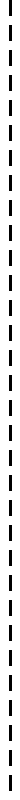
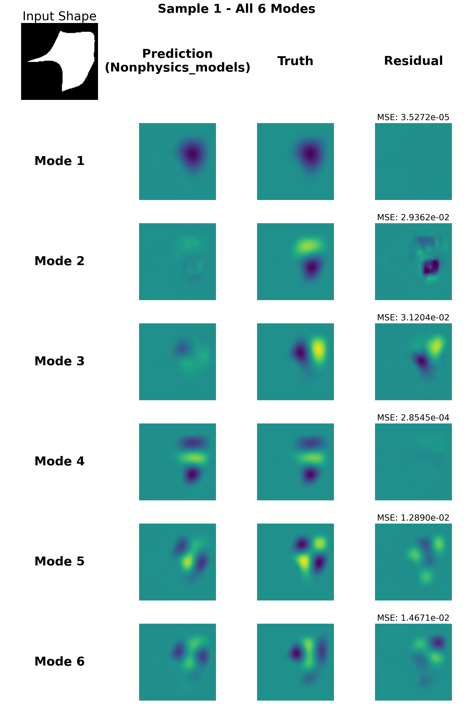

# Physics-Informed Eigen-Solution Neural Network

<p align="center">
  <b>Eigen Mode Shape Prediction</b>
</p>


<p align="center">
  
  
  
</p>


<p align="center">
  <em>Left: Physics-informed model predictions | Right: Non-physics model predictions</em><br>
  <em>Sample 1 - All 6 Modes comparison showing Prediction, Truth, and Residual</em>
</p>

## Introduction & Setup

We introduce a framework for predicting mode shapes of mechanical structures using Physics-Informed Neural Networks (PINNs). The model learns to predict eigenvalue modifications based on input geometry.

To conduct similar studies, start by cloning this repository via:

```bash
git clone https://github.com/Jasper123y/Physics-Informed-Eigen-Solution-Neural-Networks.git
```

Next, download or prepare the data and pretained model checkpoints from https://doi.org/10.5281/zenodo.18524566
Organize the files as shown below:

```
.
├── data_benchmark
│   ├── inputs/
│   └── Truth/
│       ├── outputs_mode1/
│       ├── outputs_mode2/
│       └── ...
├── data_training
│   ├── inputs/
│   └── outputs_mode1/ ... outputs_mode6/
├── models_trained
│   ├── Physics_models/
│   │   └── *.h5
│   └── Nonphysics_models/
│       └── *.h5
└── ...
```

## Dependencies

The framework was developed and tested on Python 3.8+ using TensorFlow with GPU support and requires the following Python packages.

| Package | Version (>=) |
|---------|--------------|
| tensorflow | 2.10.0 |
| numpy | 1.23.0 |
| matplotlib | 3.6.0 |
| pillow | 9.0.0 |
| h5py | 3.7.0 |

Install dependencies with:

```bash
pip install tensorflow numpy matplotlib pillow h5py
```

## Usage

We provide a unified runner script for both training and benchmark evaluation.

**Quick Start:**

```bash
# Run benchmark evaluation
python runner.py --mode benchmark

# Run physics training (with physics-informed loss)
python runner.py --mode training --training-type physics

# Run non-physics training (MSE only)
python runner.py --mode training --training-type nonphysics

# Check environment and configuration
python runner.py --check
```

### Training Modes

The framework supports two training modes:

| Mode | Flag | Loss Function | Description |
|------|------|---------------|-------------|
| **Physics** | `--training-type physics` | MSE + Helmholtz + Symmetry + K-deviation + Orthogonality | Physics-informed neural network with domain knowledge |
| **Non-Physics** | `--training-type nonphysics` | MSE only | Standard neural network without physics constraints |

**Physics Training** uses a multi-stage loss schedule:
- Epochs 0-100: MSE loss only (initial learning)
- Epochs 100-400: Symmetry + Helmholtz + K-deviation + Orthogonality losses
- Epochs 400+: Symmetry loss only (refinement)

**Non-Physics Training** uses MSE loss throughout all epochs.

Models are saved to:
- Physics models: `models_trained/Physics_models/`
- Non-Physics models: `models_trained/Nonphysics_models/`

The benchmark results will be stored in `benchmark_outputs/` and should display comparisons similar to the figures shown above. Each sample shows:
- **Prediction**: Model output for all 6 modes
- **Truth**: Ground truth mode shapes
- **Residual**: Difference with MSE values

## Configuration

All parameters are centralized in `config.py`:

| Config Class | Parameters |
|--------------|------------|
| **DataConfig** | Data paths, input shape (128×128), number of modes (6) |
| **ModelConfig** | Model paths, expected model count |
| **TrainingConfig** | Epochs, batch size, learning rate |
| **BenchmarkConfig** | Number of samples, output format |

## Project Structure

```
Version_3/
├── config.py          # Centralized configuration
├── runner.py          # Main entry point with validation
├── benchmark.py       # Benchmark/evaluation script
├── train.py           # Training script
├── data_benchmark/    # Benchmark data
├── data_training/     # Training data
├── models_trained/    # Trained model checkpoints
│   ├── Physics_models/
│   └── Nonphysics_models/
├── benchmark_outputs/ # Generated results
└── docs/
    └── images/        # Documentation images
```

## Citation

If this code is useful for your research, please cite our work:

```bibtex
@article{YourName2024,
  author = {Your Name},
  title = {{Physics-Informed Neural Network for Local Eigenvalue Modification}},
  journal = {Journal Name},
  year = {2024}
}
```

## License

MIT License
